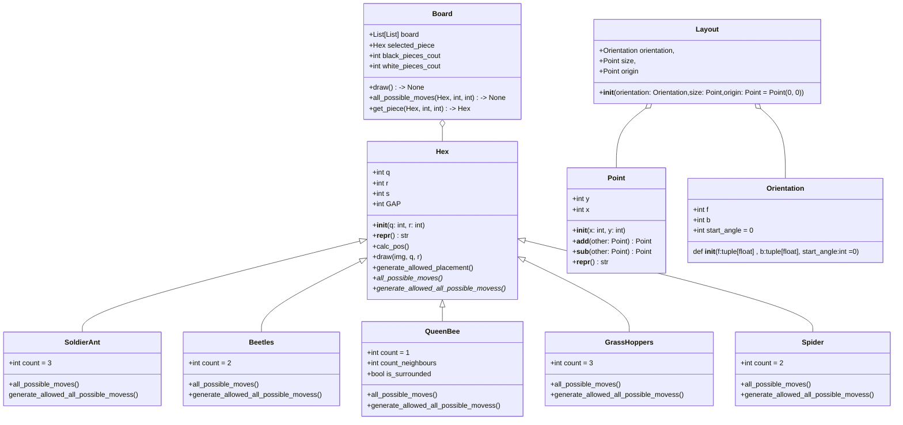

# Class Diagrams

```mermaid
classDiagram
    Board: +List[List] board
    Board: +Hex selected_piece
    Board: +int black_pieces_cout
    Board: +int white_pieces_cout
    Board: +draw()-> None
    Board: +all_possible_moves(Hex, int, int)-> None
    Board: +get_piece(Hex, int, int)-> Hex


    class Orientation{
    +int f
    +int b
    +int start_angle = 0
    def __init__(f:tuple[float] , b:tuple[float], start_angle:int =0) 
    }
    

    class Hex{
        +int q
        +int r
        +int s
        +int GAP
        +__init__(q: int, r: int)
        +__repr__() str
        +calc_pos()
        +draw(img, q, r)
        +generate_allowed_placement()
        +all_possible_moves()*
        +generate_allowed_all_possible_movess()*
    }

    class Point {
        +int y
        +int x
        +__init__(x: int, y: int)
        +__add__(other: Point) Point
        +__sub__(other: Point) Point
        +__repr__() str
    }
    class Layout{
        +Orientation orientation,
        +Point size,
        +Point origin
        +__init__(orientation: Orientation,size: Point,origin: Point = Point(0, 0))
    }


    class SoldierAnt{
        +int count = 3
        +all_possible_moves()
        generate_allowed_all_possible_movess()
    }    
    class Beetles{
        +int count = 2
        +all_possible_moves()
        +generate_allowed_all_possible_movess()
    }
    class QueenBee{
        +int count = 1
        +int count_neighbours
        +bool is_surrounded
        +all_possible_moves()
        +generate_allowed_all_possible_movess()
    }
    class GrassHoppers{
        +int count = 3
        +all_possible_moves()
        +generate_allowed_all_possible_movess()
    }
    class Spider{
        +int count = 2
        +all_possible_moves()
        +generate_allowed_all_possible_movess()
    }


    Layout o-- Point
    Layout o-- Orientation
    Board o-- Hex
    Hex <|-- SoldierAnt
    Hex <|-- Beetles
    Hex <|-- QueenBee
    Hex <|-- GrassHoppers
    Hex <|-- Spider

```
