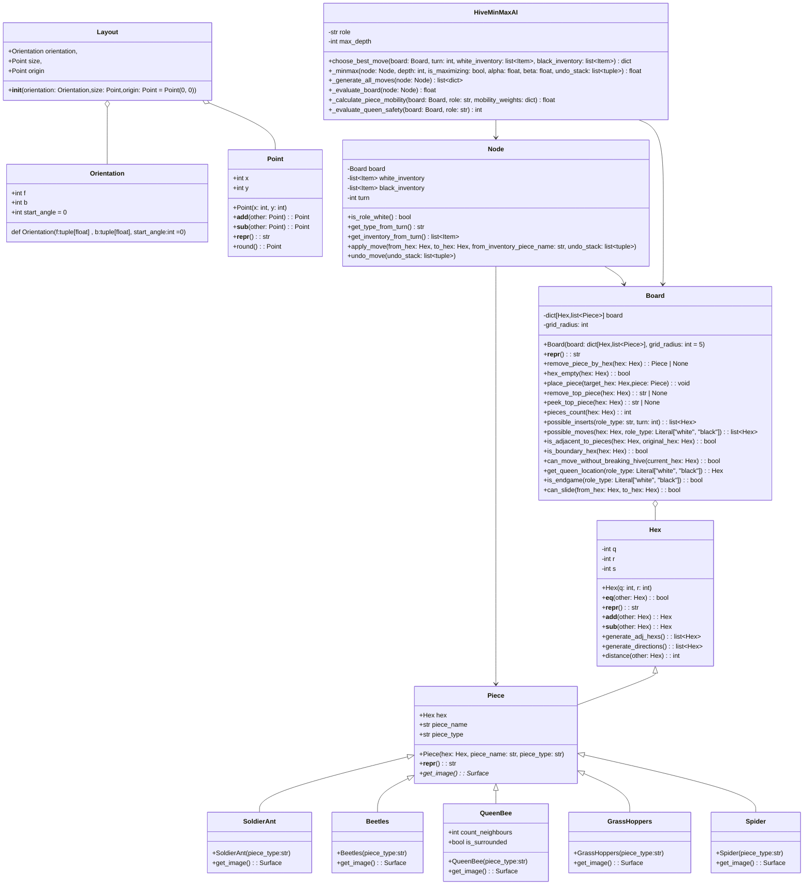

# Class Diagrams

```mermaid
classDiagram
    class Board {
        -dict[Hex,list~Piece~] board
        -grid_radius: int

        +Board(board: dict[Hex,list~Piece~], grid_radius: int = 5)
        +__repr__(): str
        +remove_piece_by_hex(hex: Hex): Piece | None
        +hex_empty(hex: Hex): bool
        +place_piece(target_hex: Hex,piece: Piece): void
        +remove_top_piece(hex: Hex): str | None
        +peek_top_piece(hex: Hex): str | None
        +pieces_count(hex: Hex): int
        +possible_inserts(role_type: str, turn: int): list~Hex~
        +possible_moves(hex: Hex, role_type: Literal["white", "black"]): list~Hex~
        +is_adjacent_to_pieces(hex: Hex, original_hex: Hex): bool
        +is_boundary_hex(hex: Hex): bool
        +can_move_without_breaking_hive(current_hex: Hex): bool
        +get_queen_location(role_type: Literal["white", "black"]): Hex
        +is_endgame(role_type: Literal["white", "black"]): bool
        +can_slide(from_hex: Hex, to_hex: Hex): bool
    }


    class Orientation{
        +int f
        +int b
        +int start_angle = 0
        def Orientation(f:tuple[float] , b:tuple[float], start_angle:int =0)
    }

    class Piece {
        +Hex hex
        +str piece_name
        +str piece_type
        +Piece(hex: Hex, piece_name: str, piece_type: str)
        +__repr__(): str
        +get_image()*: Surface
    }


    class Hex {
        -int q
        -int r
        -int s

        +Hex(q: int, r: int)
        +__eq__(other: Hex): bool
        +__repr__(): str
        +__add__(other: Hex): Hex
        +__sub__(other: Hex): Hex
        +generate_adj_hexs(): list~Hex~
        +generate_directions(): list~Hex~
        +distance(other: Hex): int
    }


    class Layout{
        +Orientation orientation,
        +Point size,
        +Point origin
        +__init__(orientation: Orientation,size: Point,origin: Point = Point(0, 0))
    }


    class Point {
        +int x
        +int y
        +Point(x: int, y: int)
        +__add__(other: Point): Point
        +__sub__(other: Point): Point
        +__repr__(): str
        +round(): Point
    }

    class SoldierAnt{

        +SoldierAnt(piece_type:str)
        +get_image(): Surface
    }
    class Beetles{

        +Beetles(piece_type:str)
        +get_image(): Surface
    }
    class QueenBee{

        +int count_neighbours
        +bool is_surrounded
        +QueenBee(piece_type:str)
        +get_image(): Surface
    }
    class GrassHoppers{

        +GrassHoppers(piece_type:str)
        +get_image(): Surface
    }
    class Spider{

        +Spider(piece_type:str)
        +get_image(): Surface
    }
    class Node {
        -Board board
        -list~Item~ white_inventory
        -list~Item~ black_inventory
        -int turn
        +is_role_white() bool
        +get_type_from_turn() str
        +get_inventory_from_turn() list~Item~
        +apply_move(from_hex: Hex, to_hex: Hex, from_inventory_piece_name: str, undo_stack: list~tuple~)
        +undo_move(undo_stack: list~tuple~)
    }

    class HiveMinMaxAI {
        -str role
        -int max_depth
        +choose_best_move(board: Board, turn: int, white_inventory: list~Item~, black_inventory: list~Item~) dict
        +_minmax(node: Node, depth: int, is_maximizing: bool, alpha: float, beta: float, undo_stack: list~tuple~) float
        +_generate_all_moves(node: Node) list~dict~
        +_evaluate_board(node: Node) float
        +_calculate_piece_mobility(board: Board, role: str, mobility_weights: dict) float
        +_evaluate_queen_safety(board: Board, role: str) int
    }


    Node --> Board
    Node --> Piece
    HiveMinMaxAI --> Node
    HiveMinMaxAI --> Board

    Hex <|-- Piece

    Layout o-- Point
    Layout o-- Orientation
    Board o-- Hex
    Piece <|-- SoldierAnt
    Piece <|-- Beetles
    Piece <|-- QueenBee
    Piece <|-- GrassHoppers
    Piece <|-- Spider

```
