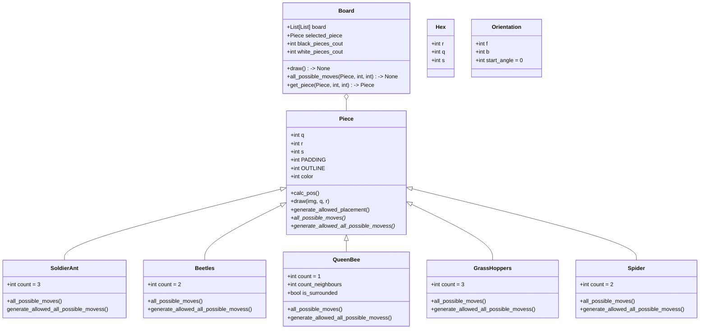

# Class Diagrams

```mermaid
classDiagram
    Board: +List[List] board
    Board: +Piece selected_piece
    Board: +int black_pieces_cout
    Board: +int white_pieces_cout
    Board: +draw()-> None
    Board: +all_possible_moves(Piece, int, int)-> None
    Board: +get_piece(Piece, int, int)-> Piece

    Hex:+int r
    Hex:+int q
    Hex:+int s


    Orientation:+int f
    Orientation:+int b
    Orientation:+int start_angle = 0

    Piece: +int q
    Piece: +int r
    Piece: +int s
    Piece: +int PADDING
    Piece: +int OUTLINE
    Piece: +int color
    Piece: +calc_pos()
    Piece: +draw(img, q, r)
    Piece: +generate_allowed_placement()
    Piece: +all_possible_moves()*
    Piece: +generate_allowed_all_possible_movess()*

    class SoldierAnt{
        +int count = 3
        +all_possible_moves()
        generate_allowed_all_possible_movess()
    }    
    class Beetles{
        +int count = 2
        +all_possible_moves()
        +generate_allowed_all_possible_movess()
    }
    class QueenBee{
        +int count = 1
        +int count_neighbours
        +bool is_surrounded
        +all_possible_moves()
        +generate_allowed_all_possible_movess()
    }
    class GrassHoppers{
        +int count = 3
        +all_possible_moves()
        +generate_allowed_all_possible_movess()
    }
        class Spider{
        +int count = 2
        +all_possible_moves()
        +generate_allowed_all_possible_movess()
    }

    Board o-- Piece
    Piece <|-- SoldierAnt
    Piece <|-- Beetles
    Piece <|-- QueenBee
    Piece <|-- GrassHoppers
    Piece <|-- Spider

```
