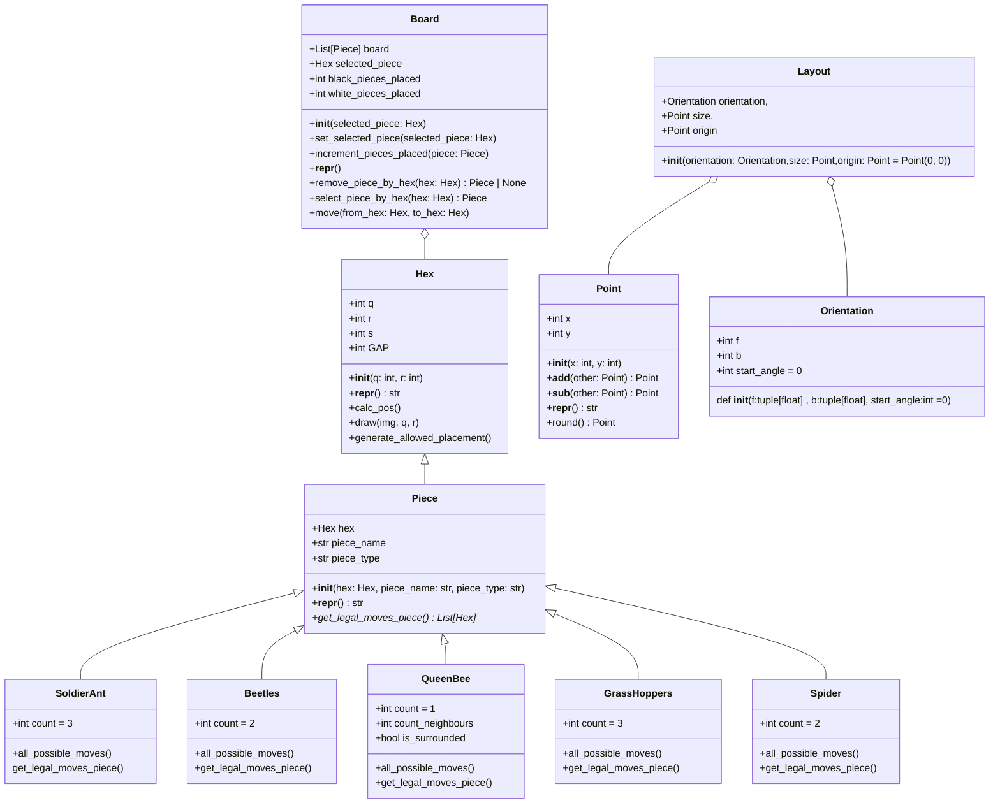

# Class Diagrams

```mermaid
classDiagram
    class Board {
        +List[Piece] board
        +Hex selected_piece
        +int black_pieces_placed
        +int white_pieces_placed
        +__init__(selected_piece: Hex)
        +set_selected_piece(selected_piece: Hex)
        +increment_pieces_placed(piece: Piece)
        +__repr__()
        +remove_piece_by_hex(hex: Hex) Piece | None
        +select_piece_by_hex(hex: Hex) Piece
        +move(from_hex: Hex, to_hex: Hex)
    }


    class Orientation{
        +int f
        +int b
        +int start_angle = 0
        def __init__(f:tuple[float] , b:tuple[float], start_angle:int =0) 
    }

    class Piece {
        +Hex hex
        +str piece_name
        +str piece_type
        +__init__(hex: Hex, piece_name: str, piece_type: str)
        +__repr__() str
        +get_legal_moves_piece()* List[Hex]
    }
    

    class Hex{
        +int q
        +int r
        +int s
        +int GAP
        +__init__(q: int, r: int)
        +__repr__() str
        +calc_pos()
        +draw(img, q, r)
        +generate_allowed_placement()

    }

    class Layout{
        +Orientation orientation,
        +Point size,
        +Point origin
        +__init__(orientation: Orientation,size: Point,origin: Point = Point(0, 0))
    }


    class Point {
        +int x
        +int y
        +__init__(x: int, y: int)
        +__add__(other: Point) Point
        +__sub__(other: Point) Point
        +__repr__() str
        +round() Point
    }

    class SoldierAnt{
        +int count = 3
        +all_possible_moves()
        get_legal_moves_piece()
    }    
    class Beetles{
        +int count = 2
        +all_possible_moves()
        +get_legal_moves_piece()
    }
    class QueenBee{
        +int count = 1
        +int count_neighbours
        +bool is_surrounded
        +all_possible_moves()
        +get_legal_moves_piece()
    }
    class GrassHoppers{
        +int count = 3
        +all_possible_moves()
        +get_legal_moves_piece()
    }
    class Spider{
        +int count = 2
        +all_possible_moves()
        +get_legal_moves_piece()
    }

    Hex <|-- Piece

    Layout o-- Point
    Layout o-- Orientation
    Board o-- Hex
    Piece <|-- SoldierAnt
    Piece <|-- Beetles
    Piece <|-- QueenBee
    Piece <|-- GrassHoppers
    Piece <|-- Spider

```
