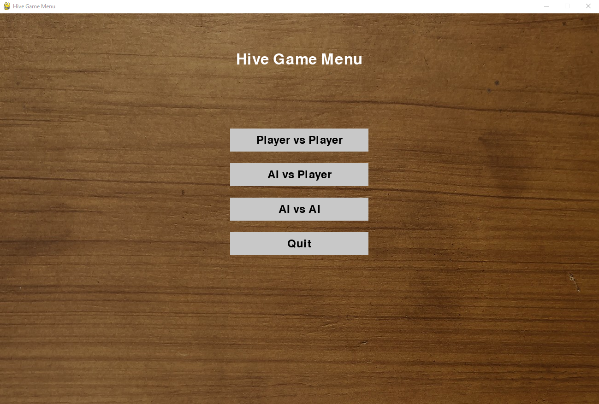
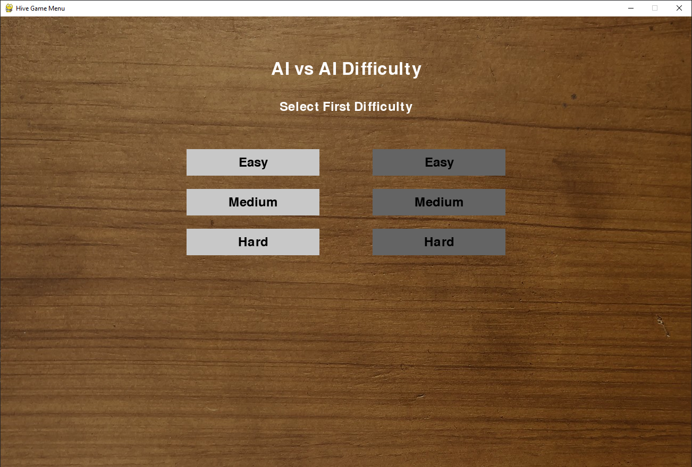
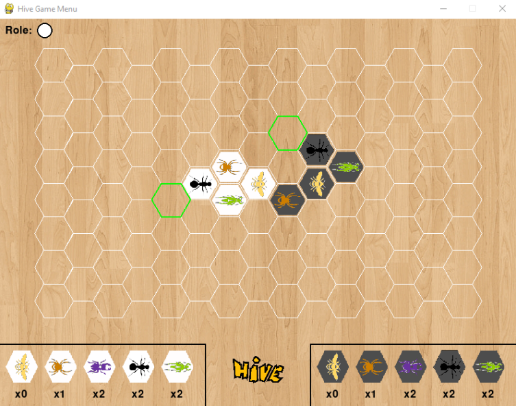
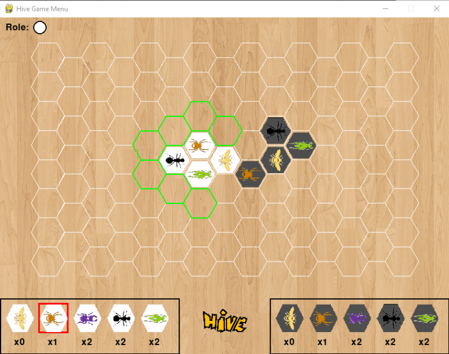
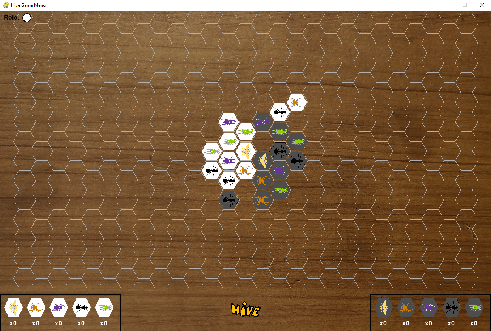
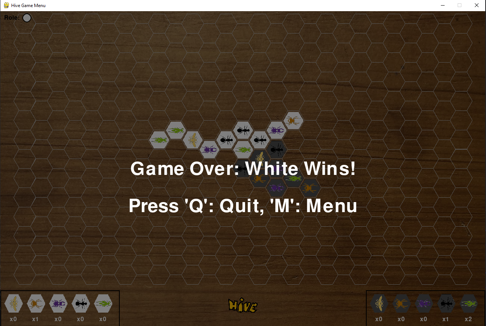

# Hive Game

Welcome to the Hive Game! This is a digital version of the Hive board game implemented in Python using Pygame. The game supports different modes including Player vs Player, AI vs Player, and AI vs AI.

## Table of Contents

- [Hive Game](#hive-game)
  - [Table of Contents](#table-of-contents)
  - [Screenshots](#screenshots)
  - [Usage](#usage)
  - [Installation](#installation)
  - [Game Modes](#game-modes)
  - [Controls](#controls)
  - [AI Difficulty Levels](#ai-difficulty-levels)
  - [Contributing](#contributing)


## Screenshots








## Usage

Once you run the game, you will be presented with the main menu. From here, you can select the game mode and start playing.

## Installation

To run this game, you need Python 3.10.15 or above. Follow these steps to install the dependencies:

1. Ensure you have Python 3.10.15 or above installed. You can download it from [python.org](https://www.python.org/downloads/).

2. Install the required dependencies using `pip`:

```sh
pip install -r requirements.txt
```


## Game Modes

- **Player vs Player:** Two players can play against each other on the same machine.
- **AI vs Player:** Play against the computer. You can select the difficulty level for the AI.
- **AI vs AI:** Watch two AI players compete against each other. You can set different difficulty levels for each AI.

## Controls

- **Mouse Click:** Select pieces from the inventory or the board, and make moves.
- **Spacebar:** Skip turn when no legal moves are available.

## AI Difficulty Levels

- **Easy:** The AI makes basic moves with minimal strategy.
- **Medium:** The AI uses a moderate level of strategy.
- **Hard:** The AI employs advanced strategies and heuristics to make the best possible moves.

## Contributing

Contributions are welcome! Please fork the repository and create a pull request with your changes.
