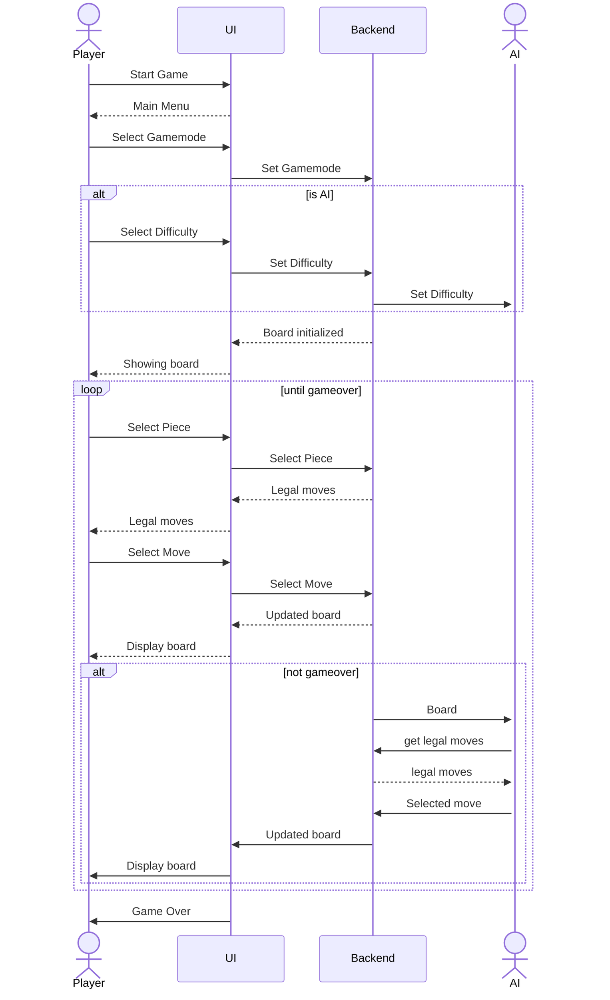
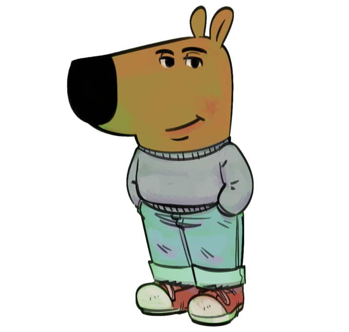

# Sequence Diagram

```mermaid

sequenceDiagram
actor Player
Player ->> UI: Start Game
UI -->> Player: Main Menu
Player ->> UI: Select Gamemode
UI ->> Backend: Set Gamemode
alt is AI
Player ->> UI: Select Difficulty
UI ->> Backend: Set Difficulty
actor AI
Backend ->>+ AI: Set Difficulty
end
Backend -->> UI: Board initialized
UI -->> Player: Showing board
loop until gameover
Player ->> UI: Select Piece
UI ->> Backend: Select Piece
Backend -->> UI: Legal moves
UI -->> Player: Legal moves
Player ->> UI: Select Move
UI ->> Backend: Select Move
Backend -->> UI: Updated board
UI -->> Player: Display board
alt not gameover
Backend ->> AI: Board
AI ->> Backend: get legal moves
Backend -->> AI: legal moves
AI ->> Backend: Selected move
Backend ->> UI: Updated board
UI ->> Player: Display board
end
end
UI ->> Player: Game Over

```

    

