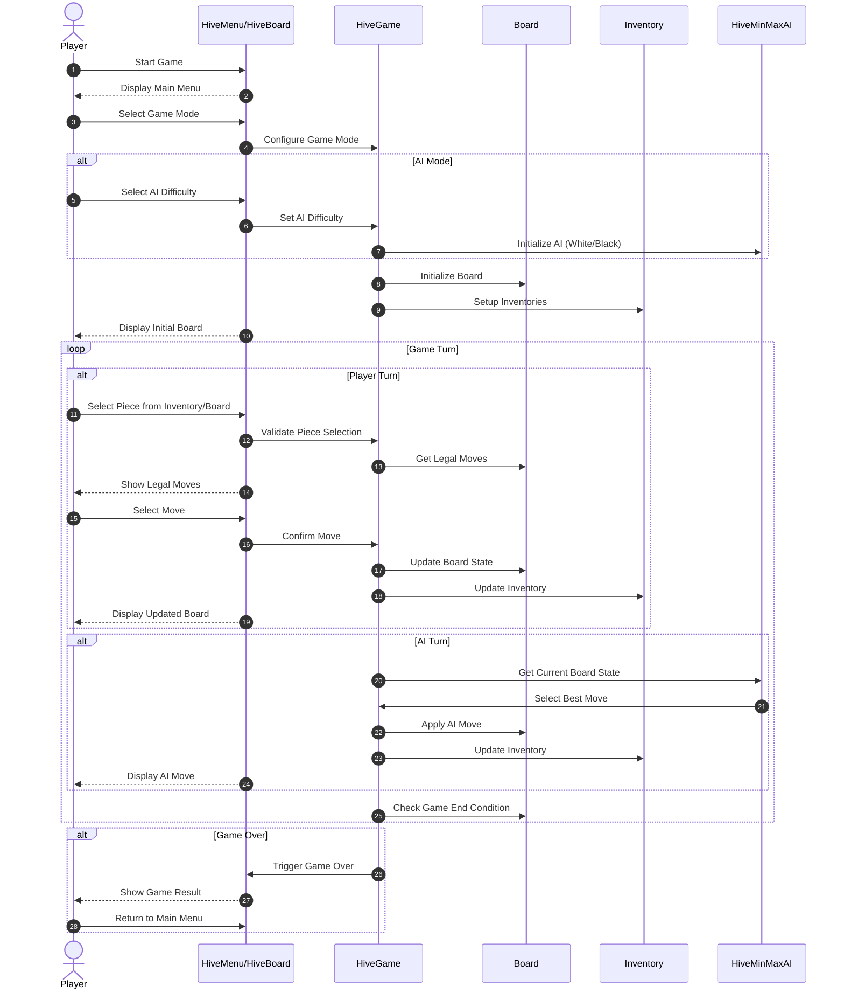

# Sequence Diagram

```mermaid

sequenceDiagram
    autonumber
    actor Player
    participant UI as HiveMenu/HiveBoard
    participant Game as HiveGame
    participant Board as Board
    participant Inventory as Inventory
    participant AI as HiveMinMaxAI

    Player ->> UI: Start Game
    UI -->> Player: Display Main Menu
    Player ->> UI: Select Game Mode
    UI ->> Game: Configure Game Mode
    
    alt AI Mode
        Player ->> UI: Select AI Difficulty
        UI ->> Game: Set AI Difficulty
        Game ->> AI: Initialize AI (White/Black)
    end

    Game ->> Board: Initialize Board
    Game ->> Inventory: Setup Inventories
    UI -->> Player: Display Initial Board

    loop Game Turn
        alt Player Turn
            Player ->> UI: Select Piece from Inventory/Board
            UI ->> Game: Validate Piece Selection
            Game ->> Board: Get Legal Moves
            UI -->> Player: Show Legal Moves
            
            Player ->> UI: Select Move
            UI ->> Game: Confirm Move
            Game ->> Board: Update Board State
            Game ->> Inventory: Update Inventory
            UI -->> Player: Display Updated Board
        end

        alt AI Turn
            Game ->> AI: Get Current Board State
            AI ->> Game: Select Best Move
            Game ->> Board: Apply AI Move
            Game ->> Inventory: Update Inventory
            UI -->> Player: Display AI Move
        end

        Game ->> Board: Check Game End Condition
    end

    alt Game Over
        Game ->> UI: Trigger Game Over
        UI -->> Player: Show Game Result
        Player ->> UI: Return to Main Menu
    end
```

    

