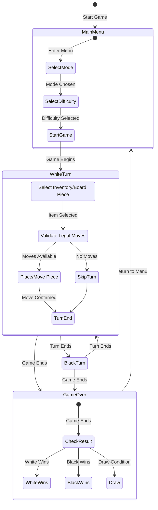

# State Diagram

```mermaid
stateDiagram-v2
    [*] --> MainMenu : Start Game
    
    state MainMenu {
        [*] --> SelectMode : Enter Menu
        SelectMode --> SelectDifficulty : Mode Chosen
        SelectDifficulty --> StartGame : Difficulty Selected
    }
    
    StartGame --> WhiteTurn : Game Begins
    
    state WhiteTurn {
        SelectItem : Select Inventory/Board Piece
        CheckMoves : Validate Legal Moves
        PossibleActions : Place/Move Piece
        
        SelectItem --> CheckMoves : Item Selected
        CheckMoves --> PossibleActions : Moves Available
        CheckMoves --> SkipTurn : No Moves
        PossibleActions --> TurnEnd : Move Confirmed
        SkipTurn --> TurnEnd
    }
    
    WhiteTurn --> BlackTurn : Turn Ends
    

    BlackTurn --> WhiteTurn : Turn Ends
    
    state GameOver {
        [*] --> CheckResult : Game Ends
        CheckResult --> WhiteWins : White Wins
        CheckResult --> BlackWins : Black Wins
        CheckResult --> Draw : Draw Condition
    }
    
    WhiteTurn --> GameOver : Game Ends
    BlackTurn --> GameOver : Game Ends
    GameOver --> MainMenu : Return to Menu
    
```